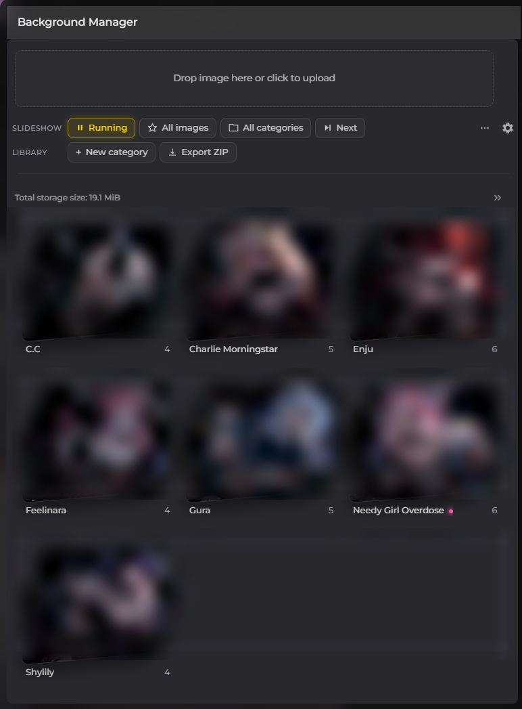
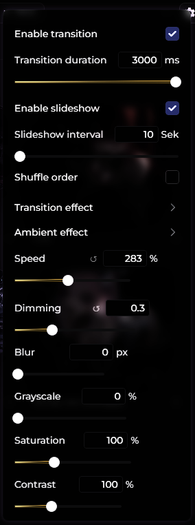

# DynamicBackgrounds

A BetterDiscord plugin that gives Discord a real background image - with a
slideshow, transitions between images, and ambient effects that keep running
while you use the app.

Images are stored locally in your browser's IndexedDB and never leave your
machine. The only network request the plugin makes is a version check against
GitHub shortly after start - see [Updates](#updates).

---

## Screenshots

The gear opens transitions, ambient effects and image adjustments:

> The preview images above were blurred for this README. The plugin shows them
> sharp.

---

## Features

**Background management**

- Paste or click to upload images; drag and drop after enabling
  **Enable drop area** in the settings (off by default, because it moves the
  window in front of Discord's own drop zone)
- Add any image in Discord straight to your library by right-clicking it -
  switchable under **Add context menu entry on images**
- Organise images into categories
- Mark images as favourites
- Export your whole library as a ZIP, sorted into folders by category
- Automatic conversion to WebP to keep storage small

**Slideshow**

- Automatic image changes at a configurable interval
- Shuffle or sequential order
- Restrict the slideshow to favourites, to specific categories, or both
- Pause and resume without losing your place
- Skip to the next image manually

**Transitions** - play once when the image changes

| Effect | Description |
| --- | --- |
| Fade | Cross-fade between images |
| Slide (horizontal) | New image slides in from the side |
| Slide (from bottom) | New image rises from below |
| Zoom in | Starts enlarged and settles |
| Zoom out | Starts small and grows into place |
| Blur | Sharpens from out of focus |
| Spin | Rotates and scales into place |
| Curtain | Opens from the centre outwards |
| Wipe | Sweeps in from the left |
| Iris | Circular reveal, like a camera aperture |

**Ambient effects** - run continuously, combinable with any transition

| Effect | Description |
| --- | --- |
| Ken Burns | Slow zoom and pan |
| Drift | Gentle floating movement |
| Breathe | Subtle pulsing of scale and brightness |
| Film grain | Animated grain overlay |
| Scanlines | Rolling CRT-style lines |
| Glitch | Occasional short jolt |

A speed slider (10-600%) controls all ambient effects at once. For Glitch it
changes how often a jolt happens, while the jolt itself stays the same length.

**Image adjustments**

Dimming, blur, grayscale, saturation, contrast, and horizontal/vertical
position. Every slider has a reset button that appears once you change it.

**Live preview**

Hover an image in the grid for a moment and it is shown as the actual
background. Move away and the previous one returns. Nothing is saved - the
slideshow pauses while you look and resumes exactly where it left off.

**Riffling category stacks**

Categories are shown as fanned stacks of their images. Hover one and it riffles
through: the top card lifts, travels behind the stack and slots back in, and
only then do the others move up. The stagger is deliberate - start both at once
and the second card is already on top before the first has left, which reads as
cards appearing rather than being flipped through.

---

## Installation

1. Install [BetterDiscord](https://betterdiscord.app)
2. Download `DynamicBackgrounds.plugin.js`
3. Put it in your BetterDiscord plugins folder
   - Windows: `%appdata%\BetterDiscord\plugins`
   - macOS: `~/Library/Application Support/BetterDiscord/plugins`
   - Linux: `~/.config/BetterDiscord/plugins`
4. Enable the plugin in Discord under Settings → Plugins

### Updates

From 3.6.0 on the plugin keeps itself up to date. A few seconds after start it
fetches its own file from GitHub and compares the version in the header. If a
newer release exists, a notice appears with an **Update** button -
one click replaces the file, BetterDiscord reloads it, and that is it.

If the check fails, nothing happens beyond a line in the console. No network,
no GitHub, no update prompt - the plugin carries on as normal.

Nothing is downloaded or written without pressing that button.

### Theme compatibility

The plugin brings its own background layer and works with most themes out of
the box. If your theme paints over it, enable **Override theme CSS variable**
in the plugin settings - the plugin then detects the theme's background
variable and overrides it.

---

## Usage

Open the manager through the button in the Discord toolbar.

| Row | What it does |
| --- | --- |
| **Slideshow** | Controls what is currently playing: pause/resume, favourites filter, category filter, skip |
| **Library** | Manages the collection: create categories, export as ZIP |

The three-dot menu holds rarer actions - opening a category directly and
clearing all favourite marks. The gear opens transition, effect and adjustment
settings.

Categories appear as fanned card stacks that riffle through their images on
hover. Click one to see the images inside. A pink dot behind a category name
marks the one the current background belongs to.

Right-clicking any image in Discord offers to add it to the library directly,
as long as **Add context menu entry on images** is enabled in the settings.

---

## Notes on storage

Images without an explicit category go to **Uncategorized**. That category
cannot be deleted - deleting any other category moves its images there instead
of removing them, so it always has to exist.

Images live in IndexedDB under the database name `DynamicBackgrounds`.
Category assignments and favourite marks are stored there too, not in the
exported ZIP - the folder structure in the export preserves your categories so
you can restore them by uploading category by category.

Uninstalling the plugin does not delete your images. The plugin settings
contain a button to clear the database if you want a clean slate.

---

## Development

The plugin is a single file with no build step and no external dependencies.
Edit `DynamicBackgrounds.plugin.js` directly; BetterDiscord reloads it
automatically when the file changes.

ZIP export uses a small built-in writer rather than a library. Since images are
already compressed, entries are stored without deflate - this keeps the file
dependency-free, which BetterDiscord's guidelines require.

See [CHANGELOG.md](CHANGELOG.md) for the version history.

---

## License

MIT